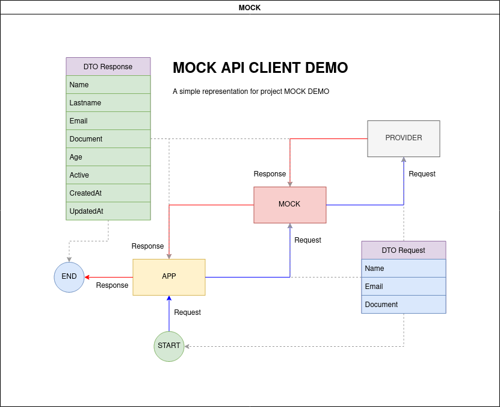

# MOCK API CLIENT DEMO
This is a demo project

# Resources

* Java 8 (jdk-8u212)
* Spring Boot 2.0.1.RELEASE
* Maven Project

# Dependencies

* Lombok 
* Spring Data JPA 
* Mysql Driver 
* Spring Rest Docs 
* Spring Web 
* Rest Repositories 
* Rest Template (Client)
* OAUTH2 (Server and Client)

---

<h4>Details</h4>
<pre>
- Linux Ubuntu 20.04 LTS

JDK
$ javac -version
javac 11.0.13

JRE
$ java -version
openjdk version "11.0.13" 2021-10-19
OpenJDK Runtime Environment (build 11.0.13+8-Ubuntu-0ubuntu1.20.04)
OpenJDK 64-Bit Server VM (build 11.0.13+8-Ubuntu-0ubuntu1.20.04, mixed mode, sharing)
</pre>

<pre>
- Windows 10 PRO

INSTALLERS
jdk-8u212-windows-x64.exe
jre1.8.0_212-windows-x64.exe (automatic download by jdk)

JDK
$ javac -version
javac 1.8.0_212

JRE
$ java -version
java version "1.8.0_212"
Java(TM) SE Runtime Environment (build 1.8.0_212-b10)
Java HotSpot(TM) 64-Bit Server VM (build 25.212-b10, mixed mode)
</pre>

---------------------------------------------------------------------------------------------------

# OVERVIEW

This project use the concept that one application can not access directly the provider resource server, so is needed to 
make the access through a proxy application, bridge application or a mock sample.

To correct use of this project you need know the correct DTO format that the provider expected and response in each request, 
then make the changes in files MockRequestDto and MockResponseDto according the provider DTO specification.

---------------------------------------------------------------------------------------------------

Enjoy !
